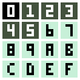

# nokiajam-pico8-template

A template + instructions for using the [PICO-8](https://www.lexaloffle.com/pico-8.php) game engine for the [Nokia 3310 game jam](https://itch.io/jam/nokiajam3)

PICO-8 doesn't support changing the resolution or color palette, but this guide will show how to do it anyway (in HTML exports)

## features
- [x] nokia3310 color palette
- [x] 84x48 resolution 
- [x] 15fps
- [x] classic font
  - note: the classic 3310 font on the [jam resources page](https://phillipp.itch.io/nokiajamresources) has some small mistakes, e.g. "M" "W" "S"
- [x] 12-key keypad (QWEASD etc)

## HOW TO MAKE YOUR GAME
- edit `game.p8`
- the first tab has a bare-bones game with an `_update()` and `_draw()` function as usual
- draw your game between 0,0 and 83,47 (inclusive)
    - there's a call to `camera()` in the last tab that will make drawing happen in a central region onscreen
    - it's centered so that the player can use the pause menu. however, the pause menu uses black pixels which [I don't currently know how to re-color](https://github.com/pancelor/nokiajam-pico8-template/issues/2), so the pause menu is disabled
- the last tab is "engine code" that makes the project run at 15 fps in the correct position onscreen. you shouldn't need to edit this tab

## HOW TO EXPORT
1. intial setup 
    - open PICO-8
    - run `folder config` -- this will open a folder in your OS
    - navigate to the `plates` subfolder
    - download [`plates/nokia3310.html`](./plates/nokia3310.html) and save it in this folder
2. exporting
    - inside PICO-8, run `export -p nokia3310 -f mycoolgame.html`
3. setting the label image
    - manually create an 84x48 image with the correct colors
    - convert the image to [base64](https://elmah.io/tools/base64-image-encoder/)
    - open `mycoolgame_html/index.html` in a text editor
    - search for `.p8_start_button{` and replace the `background:url` section with your base64 image-string
4. replace palette
    - option 1 (manual)
        - open `mycoolgame_html/mycoolgame.js` in a text editor
        - find this string...:
            - `29,43,83,126,37,83,0,135,81,171,82,54,95,87,79,194,195,199,255,241,232,255,0,77,255,163,0,255,236,39,0,228,54,41,173,255,131,118,156,255,119,168,255,204,170`
            - ...and replace it with this string:
            - `67,82,61,67,82,61,67,82,61,67,82,61,67,82,61,199,240,216,199,240,216,199,240,216,199,240,216,199,240,216,199,240,216,199,240,216,199,240,216,199,240,216,199,240,216`
            - (it's in there twice, replace both of them)
    - option 2 (automatic)
        - for commmandline folks: edit the [`change-palette.sh`](./change-palette.sh) shell script (you'll need to change a path) and then run it

## palette
- the exporting process (described above) replaces the colors 1-15 with the nokia3310 colors `#43523d` and `#c7f0d8`, like this:

Color 0 [will remain black](https://github.com/pancelor/nokiajam-pico8-template/issues/2) -- **don't use color 0 in your game**. Use colors 1 (dark) and 7 (light) (or any combination of dark+light from the table)

## license / credits
- [MIT license](./LICENSE)
- it's not required, but if you'd like to credit me I'd appreciate it; this took hours to nail down all the specifics. something like "[nokia3310 html template](https://github.com/pancelor/nokiajam-pico8-template) by [pancelor](https://pancelor.com/)". up to you!
- thanks to [Tobias V. Langhoff](https://itch.io/profile/tobiasvl) and [PaloBlancoGames](https://itch.io/profile/paloblancogames) for initial work figuring out the palette-swapping!

---

## TODO
- [ ] custom pause menu example
    - nevermind, the screen is centered on the pause menu now. but the color palette is a [big issue](https://github.com/pancelor/nokiajam-pico8-template/issues/2) -- the pause menu is black
    - one possibility might be [shaders](https://stackoverflow.com/questions/34443968/how-can-i-apply-a-pixel-shader-to-a-canvas-element), instead of editing the palette
- [x] sfx example
    - instr 3 (green) seems decent?
    - custom instruments / waveform instruments?
